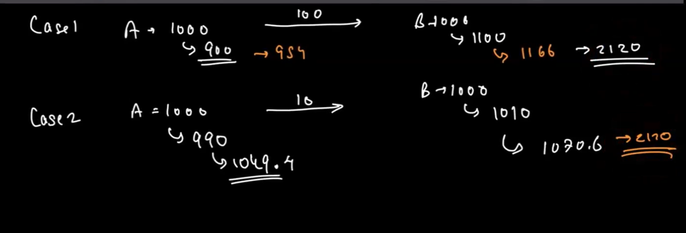
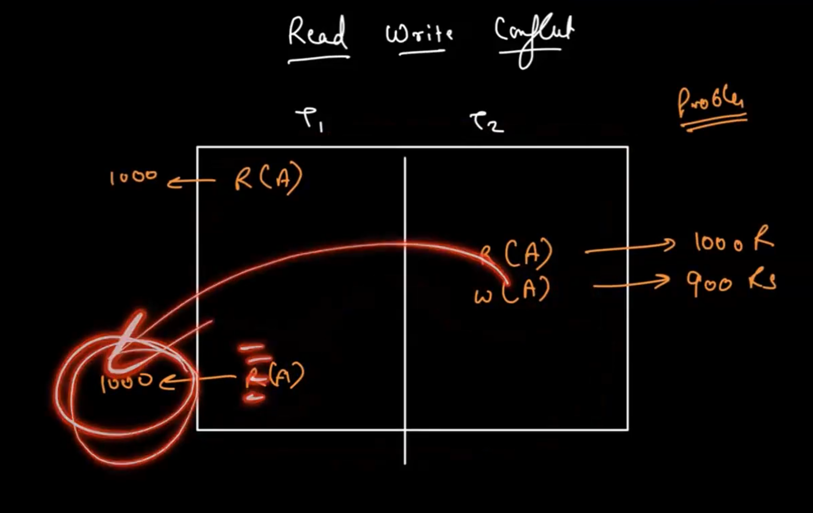

# Some Interesting problem

1. when two user tried to select the same seat.
2. payment is done by two concurrent user but only 1 seat is left.
3. payment kri but humko response hi ni aaya.
 - payment puchi hi nhi payament service thak
 - payment puchgyi service tak but un-successfully rhi but tumpe uska koi response ni aaya or vice-versa.

 ## Database Transcation
  - What is a db transcation?
    - IN real life situations, we might need to execute a series of queries in order to accomplish a task.
    - We might do a club of crud operations (like to read a record,update a record etc...)
    - These series of operations can a exceute in a single unit of work. Hence, these series of operation are called TRANSCATION.
    - Now , during the txns execution our database might go through a lot of changes and can be inconsistent intermediate state.[kuch data update hua kuch nhi]
    - to overcome the inconsistent intermediate state, it is a a duty of database capaibility.
    - #### They are 4 transcation capabilities. and these 4 are called ACID properites.
        - A -> Atomicity
        - C -> Consistency
        - I -> Isolation
        - D -> Durability
     -  #### Atomicity
         - A txn is a bundle of statements that intends to achieve one final state. When we are attempting a txn, we either want to complete all the statement or non of them. We never want a intermediate state. This called as Atomicity.
         - State of the txns
            -> Begin - when txn is just started.
            -> Commit - all the changes are applies successfully.
            -> Rollback - something happened in between and then whatever changes will successfully will be reverted.
     - #### Consistency
        - A data stored in a db is always vaild and in a consistent state.
     - #### Isolation
        - It is an ability of mulitple txns of execute without interferring with one another.
    - #### Durability
        - If something changed in a database and any unseen for circumstances happens then our changes should persist.
        - ex: db crashed - but you made some changes but you dont want loose these changes. [durabaility]
 

 #### Problems withs txns

   

   

   

 #### Execution Anaomlies 

   - Read-Write conflict (Unrepeatable Read)
      - 
   - Write-Read Conflict (Dirty Read) 
      - 
   - Write-Write Conflict (OverWriting un-commited data)
      - 

#### How databases ensure atomicity?
   - Logging --> 
      - DBMS logs all the actions that it is doing so that later it can be undo.
      - it can stores maybe in memory or disk. depends on the efficiency.
      - logging is just like a black box in airplane. where sab hota h record.
      - ex: all db - mysql,sql

   - Shadow pagging --> 
      - Dbms makes a copy of actions. This actions is initally considered as a temp copy.If txn is succeeds then is starts pointing to the new temp copy.
      - if txn is unsucceed then it points to old copy only. dont point to temp copy.
      - ex - couch db.

 

 #### Atomicity in MySQL
   - After each commit or rollback,db remains in a consistent state.
   - In order to handle rollback, There are mechanism involve called - Undo log and Redo log
      - Undo Log - 
        - This log contains records about how to undo the last change done by a transcation.
        - If any other transcation need a original data as a part of consistent read operation then unmodified data can retreive from undo log.
      - Redo Log - 
        - The redo log is a disk based data structure used for crash re-covery to correct data written  by incomplete txns. The changes which cloud make it up to the data file before the crash or any other reason are replayed automatically during restart of the server after the crash.
 

#### Isolation Levels:[[WikiPedia](https://en.wikipedia.org/wiki/Isolation_(database_systems))]
   - Read uncommited:(only benefit --> Pretty fast)
      - There is alomost no isolation here.
      - It reads the the latest uncommited value at every step that can  be updated from other uncommited txns.
      - Dirty are possible.
      - eg : user registration
   
   - Read committed
      - Here Dirty reads is avoided.
      - coz any uncommited changes are not visible to other txns until we commited.
      - In this txns, each selected statement will have its own snapshot of its data which is problematic if we execute same select again and again coc some other txns might commited and update and will see new data in the second select.
      
   - Repeatable Read
      - A snapshot of select is taken first then it runs during a txn and same snapshot is used throughout a txn when same select is executed.
      - A txn is runninig in this level doesn't take into into account any changes to a data made by other txns.
      - But this brings a phantom read problem. i.e new row exist in between which was not before.
   
   - Serializable
      - It compeletly isolate the effect of one txn from others.
      - It is a repeatable read with more isolation to avoid phantom read.

   
#### Durability:
   - the db should be durable enough to hold all the latest update even if system fails or restarts.
   - If a txn updates, a chunk of data and commits then the db will hold the new data.
   - If txn commits but system fails before the data could be written then data should be written back when system re-starts.

##### MySql Architecture [INNODB]
[Article](https://medium.com/geekculture/mysql-storage-engine-innodb-45296fb49e31#:~:text=InnoDB%20is%20the%20default%20storage,is%20the%20most%20recent%20data.)

#### Consistency

 - Consistency in InnoDB protecting data from crashes and maintain the data integrity and consistency.
 - It gives two main features.
   - "Double Write Buffer"
     - Before understanding Double Write Buffer, let understand below two things:
         - Page -> It is a unit that specifices that how much data can be transfer between disk and memory. A page can contain one and  more rows. If one row doesn't fit in the page then InnoDB set up additional 'Pointer style Data structure' so that whole info of the row go in a  page.
         - Flash -> When we write something to the database, It is not written instantly for performace reason in mysql. Instead it stores that either in memory or temp disk storage.InnoDB storage structure that are periodically flashed includes Redo log,Undo log and buffer pool. Flasing can happen coz a memory area become full and system needs to free some space, coz there is any commit involves then txn has to be finalist.

      - the Double write buffer is a storage  where InnoDb write the pages flashed from the buffer pool before writing the pages to their position in the data files[disk file pages].
      - If a system crashes in a middle of a page write, then InnoDB finds a good copy from double write buffer.
   

   - Crash Recovery 
      - It recovers from any crashes by checking the Logs.

Race Condition - 
   - when two or more enitities tried to access the same resources.
   -  To Avoid -> we can make the serialize isolation or repeatable isolation
   - BUT BUT mysql provide also a LOCKING MACHANISM to avoid race condition
      - Shared locks -> this allows multiple txns to read data at a same time but restricts any of them from writing.
      - Exclusive lock -> this prevents the txns from reading or writing the same data at the same time.
      - Intent lock - This is used to specifies that a txn is planning to read and write the certain section of data.
      - Row level lock - This allows txns to lock only a specific group.

--> MYSQL -> MVCC(mutli version con-currency control database.)
   - It is compatiable to allow mutliple txns to write and read the same data without much conflicts.??
   - Every txn in mysql is sort of capture the data . It is about to modify at the start of txn and write the changes to an entirely different version of data. This allows txn to continue working to the original data without conflicts.

   Booking service
      - Pessimistic concurrency control -> isolation use krte h jase serialize taki txn goes one by another.
      - Optimistic concurrency control -> check dalte h agr ye condition hui to ye krege other wise txn rollback krege.

Impotent operation
   - When a req is retransmitted or retried with no additional effects.
   - ex: we req to create a bank account. but due to failure or some error or some network issue, account bangya server main but client ko response ni mila to vo retry but we have only a acc. right so here Impotent means agr jo req kra h uske ek hi acc bane do na bane